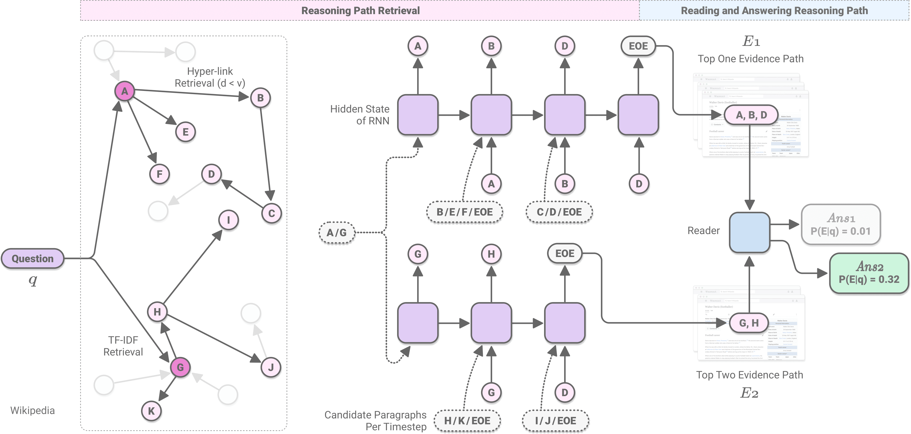

# Learning to Retrieve Reasoning Paths over Wikipedia Graph for Question Answering
<p align="center"></p>

This is the official implementation of the following paper:    
Akari Asai, Kazuma Hashimoto, Hannaneh Hajishirzi, Richard Socher, Caiming Xiong. [Learning to Retrieve Reasoning Paths over Wikipedia Graph for Question Answering](https://arxiv.org/abs/1911.10470). In: Proceedings of ICLR. 2020

In the paper, we introduce a graph-based retriever-reader framework that learns to retrieve reasoning paths (a reasoning path = a chain of multiple paragraphs to answer multi-hop questions) from English Wikipedia using its graphical structure, and further verify and extract answers from the selected reasoning paths. Our experimental results show state-of-the-art results across three diverse open-domain QA datasets: [HotpotQA (full wiki)](https://hotpotqa.github.io/), [Natural Questions](https://ai.google.com/research/NaturalQuestions/) Open, [SQuAD](https://rajpurkar.github.io/SQuAD-explorer/) Open. 

*Acknowledgements*: To implement our BERT-based modules, we used the [huggingface's transformers](https://huggingface.co/transformers/) library. The implementation of TF-IDF based document ranker and splitter started from the [DrQA](https://github.com/facebookresearch/DrQA) and [document-qa](https://github.com/allenai/document-qa) repositories. Huge thanks to the contributors of those amazing repositories!


## Quick Links
0. [Quick Run on HotpotQA](#0-quick-run-on-hotpotqa)
1. [Installation](#1-installation)
2. [Train](#2-train)
3. [Evaluation](#3-evaluation)
4. [Interactive Demo](#4-interactive-demo)
5. [Others](#5-others)
6. [Citation and Contact](#citation-and-contact)

## 0. Quick Run on HotpotQA
We provide [quick_start_hotpot.sh](quick_start_hotpot.sh), with which you can easily set up and run evaluation on HotpotQA full wiki (on the first 100 questions).

The script will
1. download our trained models and evaluation data (See [Installation](#1-installation) for the details), 
2. run the whole pipeline on the evaluation data (See [Evaluation](#3-evaluation)), and 
3. calculate the QA scores and supporting facts scores. 

The evaluation will give us the following results:
```
{'em': 0.6, 'f1': 0.7468968253968253, 'prec': 0.754030303030303, 'recall': 0.7651666666666667, 'sp_em': 0.49, 'sp_f1': 0.7769365079365077, 'sp_prec': 0.8275, 'sp_recall': 0.7488333333333332, 'joint_em': 0.33, 'joint_f1': 0.6249458756180065, 'joint_prec': 0.6706212121212122, 'joint_recall': 0.6154999999999999}
```

Wanna try your own open-domain question? See [Interactive Demo](#4-interactive-demo)! Once you run the [quick_start_hotpot.sh](quick_start_hotpot.sh), you can easily switch to the demo mode by changing some options in the command. 

## 1. Installation 
### Requirements

Our framework requires Python 3.5 or higher. We do not support Python 2.X.     

It also requires installing [pytorch-pretrained-bert version (version 0.6.2)](https://github.com/huggingface/transformers/tree/v0.6.2) and [PyTorch](http://pytorch.org/) version 1.0 or higher. The other dependencies are listed in [requirements.txt](requirements.txt).   
We are planning to [migrate from pytorch-pretrained-bert](https://huggingface.co/transformers/migration.html) to transformers soon. 

### Set up 
Run the following commands to clone the repository and install our framework:

```bash
git clone https://github.com/AkariAsai/learning_to_retrieve_reasoning_paths.git
cd learning_to_retrieve_reasoning_paths
pip install -r requirements.txt
```

### Downloading trained models
All the trained models used in our paper for the three datasets are available in google drive: 
 - HotpotQA full wiki: [hotpot_models.zip](https://drive.google.com/open?id=1ra37xtEXSROG_f90XxR4kgElGJWUHQyM)
 - Natural Questions Open: [nq_models.zip](https://drive.google.com/open?id=120JNI49nK-W014cjneuXJuUC09To3KeQ)
 - SQuAD Open: [squad_models.zip](https://drive.google.com/open?id=1_z54KceuYXnA0fJvdASDubti9Zb8aAR4): for SQuAD Open, please download `.db` and `.npz` files following [DrQA](https://github.com/facebookresearch/DrQA/blob/master/download.sh) repository.

Alternatively, you can download a zip file containing all models by using [gdown](https://pypi.org/project/gdown/).

e.g., download HotpotQA models
```bash
mkdir models
cd models
gdown https://drive.google.com/uc?id=1ra37xtEXSROG_f90XxR4kgElGJWUHQyM
unzip hotpot_models.zip
rm hotpot_models.zip
cd ..
```
**Note: the size of the zip file is about 4GB for HotpotQA models, and once it is extracted, the total size of the models is more than 8GB (including the introductory paragraph only Wikipedia database). The `nq_models.zip` include full Wikipedia database, which is around 30GB once extracted.**


### Downloading data
#### for training
- You can download all of the training datasets from [here (google drive)](https://drive.google.com/drive/folders/1nYQOtoxJiiL5XK6PHOeluTWgh3PTOCVD?usp=sharing). 
- We create (1) data to train graph-based retriever, and (2) data to train reader by augmenting the publicly available machine reading comprehension datasets (HotpotQA, SQuAD and Natural Questions). 
See the details of the process in Section 3.1.2 and Section 3.2 in [our paper](https://arxiv.org/pdf/1911.10470.pdf). 

#### for evaluation 
- Following previous work such as [DrQA](https://github.com/shmsw25/qa-hard-em) or [qa-hard-em](https://github.com/shmsw25/qa-hard-em), we convert the original machine reading comprehension datasets to sets of question and answer pairs. You can download our preprocessed data from [here](https://drive.google.com/open?id=1na7vxYWadK2kS2aqg88RDMFir8PP-2lS).

- For HotpotQA, we only use question-answer pairs as input, but we need to use the original HotpotQA development set (either fullwiki or distractor) to evaluate supporting fact evaluations from [HotpotQA's website](https://hotpotqa.github.io/). 

```bash
mkdir data
cd data
mkdir hotpot
cd hotpot
gdown https://drive.google.com/uc?id=1m_7ZJtWQsZ8qDqtItDTWYlsEHDeVHbPt # download preprocessed full wiki data
wget http://curtis.ml.cmu.edu/datasets/hotpot/hotpot_dev_fullwiki_v1.json # download the original full wiki data for sp evaluation. 
cd ../..
```

## 2. Train
In this work, we use a two-stage training approach, which lets you train the reader and retriever independently and easily switch to new reader models. 
The details of the training process can be seen in the README files in [graph_retriever](graph_retriever), [reader](reader) and [sequence_sentence_selector](sequential_sentence_selector).

You can download our pre-trained models from the link mentioned above. 

## 3. Evaluation
After downloading a TF-IDF retriever, training a graph-retriever and reader models, you can test the performance of our entire system.


#### HotpotQA
If you set up using `quick_start_hotpot.sh`, you can run full evaluation by setting the `--eval_file_path` option to `data/hotpot/hotpot_fullwiki_first_100.jsonl` . 

```bash
python eval_main.py \
--eval_file_path data/hotpot/hotpot_fullwiki_data.jsonl \
--eval_file_path_sp data/hotpot/hotpot_dev_distractor_v1.json \
--graph_retriever_path models/hotpot_models/graph_retriever_path/pytorch_model.bin \
--reader_path models/hotpot_models/reader \
--sequential_sentence_selector_path models/hotpot_models/sequential_sentence_selector/pytorch_model.bin \
--tfidf_path models/hotpot_models/tfidf_retriever/wiki_open_full_new_db_intro_only-tfidf-ngram=2-hash=16777216-tokenizer=simple.npz \
--db_path models/hotpot_models/wiki_db/wiki_abst_only_hotpotqa_w_original_title.db \
--bert_model_sequential_sentence_selector bert-large-uncased --do_lower_case \
--tfidf_limit 500 --eval_batch_size 4 --pruning_by_links --beam_graph_retriever 8 \
--beam_sequential_sentence_selector 8 --max_para_num 2000 --sp_eval
```

The evaluation will give us the following results (equivalent to our reported results):
```
{'em': 0.6049966239027684, 'f1': 0.7330873757783022, 'prec': 0.7613180885780131, 'recall': 0.7421444532461545, 'sp_em': 0.49169480081026334, 'sp_f1': 0.7605390258327606, 'sp_prec': 0.8103758721584524, 'sp_recall': 0.7325846435805953, 'joint_em': 0.35827143821742063, 'joint_f1': 0.6143774960171196, 'joint_prec': 0.679462464277477, 'joint_recall': 0.5987834193329556}
```

#### SQuAD Open

```bash
python eval_main.py \
--eval_file_path data/squad/squad_open_domain_data.jsonl \
--graph_retriever_path models/squad_models/selector/pytorch_model.bin \
--reader_path models/squad_models/reader \
--tfidf_path DrQA/data/wikipedia/docs-tfidf-ngram=2-hash=16777216-tokenizer=simple.npz \
--db_path DrQA/data/wikipedia/docs.db \
--bert_model bert-base-uncased --do_lower_case \
--tfidf_limit 50 --eval_batch_size 4 \
--beam_graph_retriever 8 --max_para_num 2000 --use_full_article 
```

#### Natural Questions

```
python eval_main.py \
--eval_file_path data/nq_open_domain_data.jsonl \
--graph_retriever_path models/nq/selector/pytorch_model.bin --reader_path models/nq/reader/ \
--tfidf_path models/nq_models/tfidf_retriever/wiki_20181220_nq_hyper_linked-tfidf-ngram=2-hash=16777216-tokenizer=simple.npz \
--db_path models/nq_models/wiki_db/wiki_20181220_nq_hyper_linked.db \
--bert_model bert-base-uncased --do_lower_case --tfidf_limit 20 --eval_batch_size 4 --pruning_by_links \
--beam_graph_retriever 8 --max_para_num 2000 --use_full_article 
```

#### (optional) Using TagMe for initial retrieval
As mentioned in Appendix B.7 in our paper, you can optionally use an entity linking system ([TagMe](https://sobigdata.d4science.org/web/tagme/tagme-help)) for the initial retrieval.   

To uee TagMe, 
1. [register](https://services.d4science.org/group/d4science-services-gateway/explore?siteId=22994) to get API key, and 
3. set the API key via `--tagme_api_key` option, and set `--tagme` option true.  

```
python eval_main.py \
--eval_file_path data/nq_open_domain_data.jsonl \
--graph_retriever_path models/nq/selector/pytorch_model.bin --reader_path models/nq/reader/ \
--tfidf_path models/nq_models/tfidf_retriever/wiki_20181220_nq_hyper_linked-tfidf-ngram=2-hash=16777216-tokenizer=simple.npz \
--db_path models/nq_models/wiki_db/wiki_20181220_nq_hyper_linked.db \
--bert_model bert-base-uncased --do_lower_case --tfidf_limit 20 --eval_batch_size 4 --pruning_by_links --beam 8 --max_para_num 2000 --use_full_article --tagme --tagme_api_key YOUR_API_KEY
```

*The implementation of the two-step TF-IDF retrieval module (article retrieval --> paragraph-level re-ranking) for Natural Questions is currently in progress, which might give slightly lower scores than the reported results in our paper. We'll fix the issue soon.*

## 4. Interactive demo
You could run interactive demo and ask open-domain questions. Our model answers the question with supporting facts. 

If you set up using `quick_start.sh` script, you can run full evaluation by changing the script name to from `eval_main.py` to `demo.py`, and removing `--eval_file_path` and `--eval_file_path_sp` options. 

e.g.,
```bash
python demo.py \
--graph_retriever_path models/hotpot_models/graph_retriever_path/pytorch_model.bin \
--reader_path models/hotpot_models/reader \
--sequential_sentence_selector_path models/hotpot_models/sequential_sentence_selector/pytorch_model.bin \
--tfidf_path models/hotpot_models/tfidf_retriever/wiki_open_full_new_db_intro_only-tfidf-ngram=2-hash=16777216-tokenizer=simple.npz \
--db_path models/hotpot_models/wiki_db/wiki_abst_only_hotpotqa_w_original_title.db \
--do_lower_case --beam 4 --quiet --max_para_num 200 \
--tfidf_limit 20 --pruning_by_links \
```

An output example is as follows:
```
#### Reader results ####
[    {
        "q_id": "DEMO_0",
        "question": "Bordan Tkachuk was the CEO of a company that provides what sort of products?",
        "answer": "IT products and services",
        "context": [
            "Cintas_0",
            "Bordan Tkachuk_0",
            "Viglen_0"
        ]
    }
]

#### Supporting facts ####
[
    {
        "q_id": "DEMO_0",
        "supporting facts": {
            "Viglen_0": [
                [0, "Viglen Ltd provides IT products and services, including storage systems, servers, workstations and data/voice communications equipment and services."
                ]
            ],
            "Bordan Tkachuk_0": [
                [0, "Bordan Tkachuk ( ) is a British business executive, the former CEO of Viglen, also known from his appearances on the BBC-produced British version of \"The Apprentice,\" interviewing for his boss Lord Sugar."
                ]
            ]
        }
    }
]

```


## 5. Others
### Distant supervision & negative examples data generation
In this work, we augment the original MRC data with negative and distant supervision examples to make our retriever and reader robust to inference time noise. Our experimental results show these training strategy gives significant performance improvements.

All of the training data is available [here (google drive)](https://drive.google.com/drive/u/1/folders/1nYQOtoxJiiL5XK6PHOeluTWgh3PTOCVD).

*We are planning to release our codes to augment training data with negative examples and distant examples to guide future research in open-domain QA fields. Please stay tuned!*

### Dataset format 
For quick experiments and detailed human analysis, we save intermediate results for each step: original Q-A pair (format A), TF-IDF retrieval (format B), our graph-based (format C) retriever. 

#### Format A (eval data, the input of TF-IDF retriever)
For the evaluation pipeline, our initial input is a simple `jsonlines` format where each line contains one example with `id = [str]`, `question = [str]` and `answer = List[str]` (or `answers = List[str]` for datasets where multiple answers are annotated for each question) information. 

For SQuAD Open and HotpotQA fullwiki, you can download the preprocessed format A files from [here](https://drive.google.com/file/d/1f3YtvImDxB9h6GuVGFelzxvgwEcqxuHn/view?usp=sharing).

e.g., HotpotQA fullwiki dev
```
{
"id": "5ab3b0bf5542992ade7c6e39", 
"question": "What year did Guns N Roses perform a promo for a movie starring Arnold Schwarzenegger 
as a former New York Police detective?", 
"answer": ["1999"]
}
```

e.g., SQuAD Open dev
```py
{
"id": "56beace93aeaaa14008c91e0", 
"question": "What venue did Super Bowl 50 take place in?", 
"answers": ["Levi's Stadium", "Levi's Stadium", 
"Levi's Stadium in the San Francisco Bay Area at Santa Clara"]
}
```

#### Format B (TF-IDF retriever output)
For TF-IDF results, we store the data as a list of `JSON`, and each data point contains several information.

- `q_id = [str]`
- `question = [str]` 
- `answer = List[str]`
- `context = Dict[str, str]`: Top $N$ paragraphs which are ranked high by our TF-IDF retriever. 
- `all_linked_para_title_dic = Dict[str, List[str]]`: Hyper-linked paragraphs' titles from paragraphs in `context`. 
- `all_linked_paras_dic = Dict[str, str]`: the paragraphs of the hyper-linked paragraphs. 

For training data, we have additional items that are used as ground-truth reasoning paths.
- `short_gold = List[str]`
- `redundant_gold = List[str]`
- `all_redundant_gold = List[List[str]]`

e.g., HotpotQA fullwiki dev 

```py
{
"question": 'Were Scott Derrickson and Ed Wood of the same nationality?'.
"q_id": "5ab3b0bf5542992ade7c6e39", 
"context": 
    {"Scott Derrickson_0": "Scott Derrickson (born July 16, 1966) is an American director,....", 
      "Ed Wood'_0": "...", ....}, 
'all_linked_para_title_dic':
    {"Scott Derrickson_0": ['Los Angeles_0', 'California_0', 'Horror film_0', ...]},
'all_linked_paras_dic': 
    {"Los Angeles_0": "Los Angeles, officially the City of Los Angeles and often known by its initials L.A., is ...", ...}, 
'short_gold':[], 
'redundant_gold': [],
'all_redundant_gold': []
}
```

#### Format C (Graph-based retriever output)
The graph-based retriever's output is a list of `JSON` objects as follows:

- `q_id = [str]`
- `titles = [str]`: a sequence of titles (the top one reasoning path) 
- `topk_titles = List[List[str]]`: k sequences of titles (the top k reasoning paths).
- `context = Dict[str, str]`: the paragraphs which are included in top reasoning paths. 

```py
{
"q_id": "5a713ea95542994082a3e6e4",
"titles": ["Alvaro Mexia_0", "Boruca_0"],
"topk_titles": [
    ["Alvaro Mexia_0", "Boruca_0"], 
    ["Alvaro Mexia_0", "Indigenous peoples of Florida_0"], 
    ["Alvaro Mexia_0"], 
    ["List of Ambassadors of Spain to the United States_0", "Boruca_0"], 
    ["Alvaro Mexia_0", "St. Augustine, Florida_0"], 
    ["Alvaro Mexia_0", "Cape Canaveral, Florida_0"], 
    ["Alvaro Mexia_0", "Florida_0"], 
    ["Parque de la Bombilla (Mexico City)_0", "Alvaro Mexia_0", "Boruca_0"]],
"context": {
    "Alvaro Mexia_0": "Alvaro Mexia was a 17th-century Spanish explorer and cartographer of the east coast of Florida....",       "Boruca_0": "The Boruca (also known as the Brunca or the Brunka) are an indigenous people living in Costa Rica"}
}
```


## Citation and Contact
If you find this codebase is useful or use in your work, please cite our paper. 
```
@inproceedings{
asai2020learning,
title={Learning to Retrieve Reasoning Paths over Wikipedia Graph for  Question Answering},
author={Akari Asai and Kazuma Hashimoto and Hannaneh Hajishirzi and Richard Socher and Caiming Xiong},
booktitle={International Conference on Learning Representations},
year={2020}
}
```

Please contact Akari Asai ([@AkariAsai](https://twitter.com/AkariAsai?s=20), akari[at]cs.washington.edu) for questions and suggestions.
